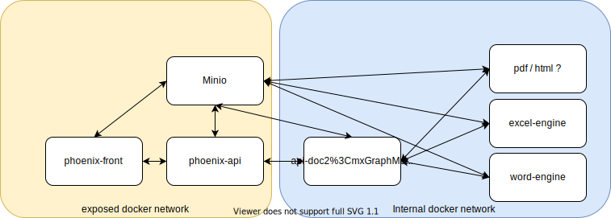

# API-DOC-2

## Docker Setup

PLS mount the conf file into /api/conf.yaml

## Installation

```sh
$ pip install -r requirements.txt
```

* Installer le moteur word-publiposting
* Installer le moteur excel-publiposting


## Utiliser en local 

### Sans docker

* Start the word-publiposting with the correct port (same as the one in `conf.yaml`)
* Start the excel-publiposting with the correct port (same as the one in `conf.yaml`)

Il vous faut un fichier de configuration valide

```sh
$ ./start_dev.sh
```

Les moteurs doivent être lancer avant api-doc2 puisque api-doc2 va les configurer au démarrage

### Avec docker

```sh
$ docker-compose up
```

Il vous faut un fichier de configuration valide qui sera monté dans le volume docker

## Configuration

La configuration est assez simple et se déroule dans le fichier `conf.yaml`

- Il suffit de mettre les variables permettant de se connecter à l'instance minio sur laquelle l'api va opérer
- Il faut ensuite mettre sous la clef **manifest** les informations des différents bucket à exposer
  - Les clefs de ce mapping seront le nom des buckets à exposer
    - output_bucket : le nom du bucket de sortie
    - tyoe : le nom sous lequel les documents seront exposés
- renseigner où se trouvent les moteurs en fonction de leurs noms

```yaml
MINIO_HOST: ""
MINIO_KEY: ""
MINIO_PASS: ""
SECURE: true

engine_settings:
  docx: 
    host: word-engine:5000
    secure: false
  xlsx:
    host: excel-engine:4000
    secure: false

manifest:
  new-templates:
    output_bucket: temporary # for testing purposes it's better :) 
    # thats the name under which the document will be accessible
    type: phoenix
```

#### Ne pas oublier de mettre des templates dans le bucket indiqué dans votre fichier de configuration

## Summary

Pourquoi api-doc2 ?

api-doc l'ancienne api de publipostage de phoenix permettait de publiposter des documents word mais était limité dans ce qu'elle pouvait faire. On ne pouvait publiposter qu'un seul type de valeurs, des missions.

De plus l'api ne supportait pas le caching ce qui baissait ses performances.

## Qu'est ce que c'est ?

api-doc2 c'est une gateway qui permet à phoenix-api de publiposter n'importe quel type de document sans avoir à faire de différence.

api-doc2 utilise donc des moteurs de rendu accessible sur le reseau

Ces moteurs sont donc disponibles au moyen de requêtes HTTP et il est ainsi très simple d'ajouter un nouveau moteur pour support un nouveau type de document.

Les moteurs vont directement tapper dans minio pour pull les templates et pousser les résultats des rendus.

## Les endpoints

### Pour publiposter

On poste sur : '/publipost'

Example

```json
 {
    "data":  {
        "mission": {
            "contact.civility.value":"JEB",
            "contact.name":"Test",
        },
        "student":{
            "name.value":"Paul"
        },
    },
    "template_name": "DDE",
    "filename": "test.docx",
    "type": "phoenix"
}
```
#### `data` 

Sous cette clef on va mettre les données à publiposter.
Pour publiposter les données sur l'objet mission, il faut ainsi les mettre sous la clef mission.

#### `template_name`

Self explenatory ?

#### `type` 

We will have multiple document repositories from now on, ex: (tresorerie, ...etc)

#### `filename` 

That's the desired filename save, that's the previous `generated_name`


### Pour get les placeholders

On fait un get sur "/document/#nom-du-bucket/#nom-template"

ça renvoie donc : 

```json
{
    "mission": [
        "previousDocumentReference(\"ARM\")",
        "StudentDocRef(#student,\"REM\")",
        "documentReference(\"AEN\")"
    ],
    "student": [
        "city",
        "address",
        "civility.value",
        "firstName",
        "zipCode",
        "lastName"
    ],
    "this": [
        "reference"
    ]
}
```

### healtcheck

Sur /live ça renvoie toujours une 200 avec un body 'OK'

Cela permet aux autres services qu'api-doc2 est live


## Comment ajouter un moteur


Pour ajouter un nouveau moteur il suffit donc de l'ajouter dans le dictionnaire de handlers et d'écrire un handler.

Pour écrire un handler il suffit donc d'implemnter l'interface de base et d'ajouter la configuration dans le fichier de configuration.


## Gestion du cache


Comme indiqué plus haut, on a maintenant du cache, ça permet de gagner du temps sur chaque query et ça évite de la charge réseau par la même occasion.

Il faut donc gérer le reload du cache. ça se fait avec l'endpoint "/reload"


## Flow général

- Démarrage des moteurs
- Démarrage de la gateway
    - lecture de la configuration
    - configuration des moteurs
    - initialisation d'un groupe de template par bucket
    - détection des templates 
    - configuration des interfaces de templates sur chacun des moteurs en fonction de l'extension du template
        - pull les templates par chacun des engine (excel, word)
        - parsing des templates sur chacun des engine
        - envoie vers la gateway des models et construction des fonctions de fallback et de remplacement sur la gateway
    
            // ici la gateway mets donc en cache dans chaque interface de templating les models de donnée en cache. Cela permet de ne pas query les moteurs à chaque fois que l'on veut les placeholder sur la gateway

- db_loaded = True
// à partir d'ici le système de publipostage est utilisable.
- en faisant des queries sur /document on peut avoir les placeholder
- en faisant des queries sur /publipost on peut publiposter des docs




## Pistes d'améliorations :

- [x] Changer la façon dont sont register les engines
- [x] Mettre à jour automatiquement le cache
- [x] Ajouter un moteur de PPT
